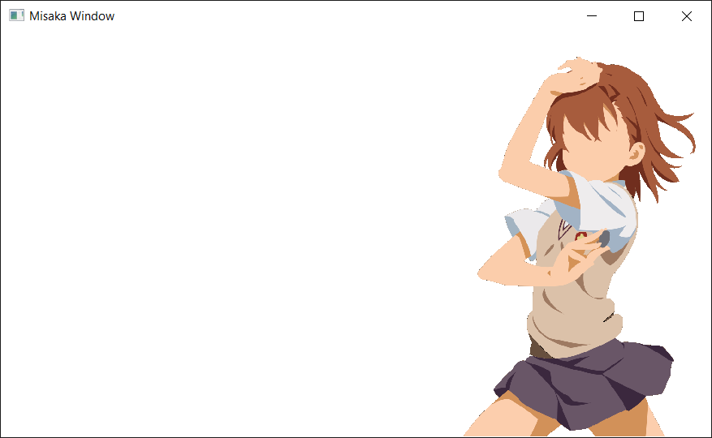

# Misaka Window System GL
Static C++ library for creating multi-platform window for OpenGL development. Also provides interface for keyboard and mouse events.

> This library is still in development and will be expanded in future.
> :warning: **Not to be used in production!**
<p align="center">
    <br>
    
</p>

## Structure
Misaka window system consists for three main classes:

* Window
* Keyboard
* Mouse

## Creating window example

```.cpp
#include <MisakaWindowSystemGL.h>

int main(const int argc, const char** argv)
{
    auto window = Misaka::Window::CreateWindow(800, 600, "Title", Misaka::Window::Configuration());
    auto kbd = Misaka::Keyboard::CreateKeyboard();
    
    while (!window->ShouldClose())
    {
        window->SwapBuffersAndPollEvents();
        if (kbd->GetKey() == MISAKA_KEY_0 && kbd->GetAction() == Misaka::Keyboard::Action::Press)
            window->Close();

        kbd->ResetState();
    }
    return 0;
}
```